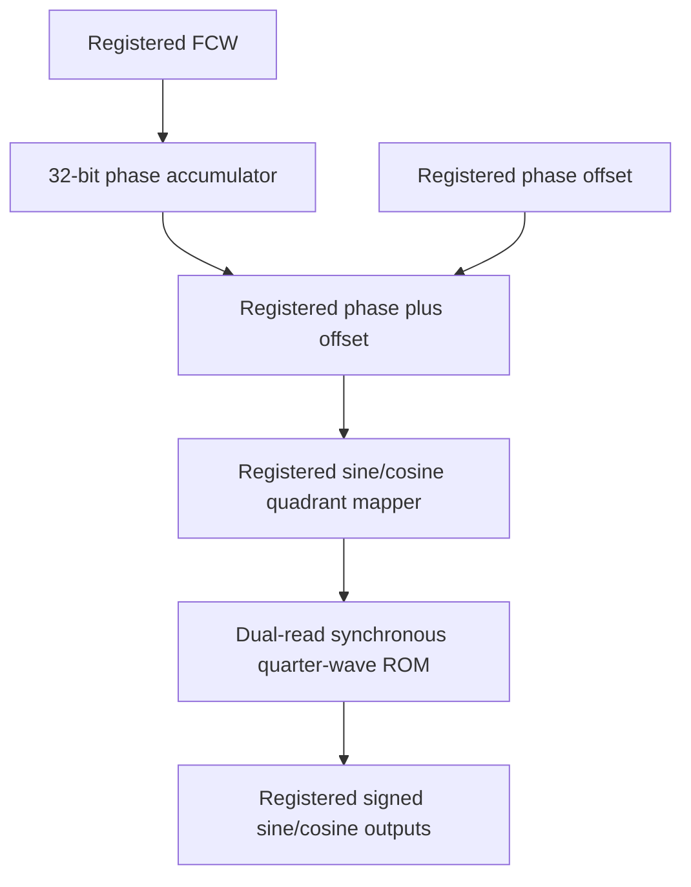

# Verilog DDS/NCO IP

The default testbench now includes a **1 kHz to 10 MHz sweep and immediate/smooth phase shifting**. Read `SWEEP_AND_PHASE.md` first for the updated tests, controls, CSV files and GTKWave instructions. The original tests are preserved under `make regression`.

This project contains hand-written Verilog-2001 RTL, a supplied coefficient ROM, executable self-checking simulation, and optional coefficient/FFT utilities. Python only creates numerical coefficients and analyzes simulation data; it never generates RTL. No MATLAB, HLS or HDL conversion is used.

## Frozen architecture

One 32-bit modulo phase accumulator drives both outputs. A separately registered offset is added before truncating to 14 phase bits. Cosine uses the same truncated phase plus exactly one quarter cycle modulo 16384; this is equivalent to adding 32'h40000000 before truncation. The quadrant mapper reflects quarter-wave addresses and passes signs and endpoint flags alongside synchronous ROM data. Registered sign reconstruction completes the pipeline.



Control has its own register path and is not an additional sample pipeline stage. The baseline top contains no slew modules. Advanced control connects separate frequency and circular phase controllers to the same sample engine. All controls must be synchronous to clk; cross-clock sources require an external atomic handshake, not independent bit synchronizers.

## Numerical design

| Property | Value | Reason |
|---|---:|---|
| Clock | 100 MHz | 10 ns target period; implementation must confirm timing |
| Accumulator/FCW/offset | 32 bits | Fine tuning without expanding ROM |
| Full-cycle phase index | 14 bits | 16384 lookup positions, about 0.02197 degrees each |
| Quarter ROM | 4096 x 16 bits | 65536 stored bits with two reads per sample |
| Output | signed 16 bits | Symmetric peak range -32767..32767 |

`FCW = round(Fout * 2^32 / Fs)`, and `Factual = FCW * Fs / 2^32`.
Frequency resolution at 100 MHz is 0.023283064365386963 Hz. This is accumulator resolution, not LUT angular or spectral resolution.

| Requested frequency | FCW decimal | FCW hexadecimal |
|---:|---:|---|
| 100 kHz | 4294967 | 00418937 |
| 500 kHz | 21474836 | 0147ae14 |
| 1 MHz | 42949673 | 028f5c29 |
| 2 MHz | 85899346 | 051eb852 |
| 5 MHz | 214748365 | 0ccccccd |
| 10 MHz | 429496730 | 1999999a |

FCW is an unsigned modulo increment; all 32-bit values are accepted. For conventional positive real waveform operation use FCW below 0x80000000 (Nyquist). Above it the sampled output aliases and can be interpreted as negative phase rotation. Exactly Nyquist can give a degenerate sine depending on starting phase. No clipping or saturation occurs in the phase engine.

The amplitude represents normalized amplitude as sample / 32767, rather than strictly Q1.15. +1 maps to +32767 and -1 to -32767; -32768 is unused. The 16-bit ROM stores nonnegative magnitudes.

## Exact edge behavior

Reset is synchronous active high and has highest priority. It clears accumulator, active controls, phase sample register, valid registers, mapper metadata, advanced current/target/step/busy registers, and visible outputs. ROM content is configuration data and is never reset. Internal ROM data registers are intentionally unreset so synthesis can infer memory output registers; their contents are irrelevant until associated valid is set. They cannot leak into visible outputs.

At rising edge E with rst=0 and enable=1:

* The engine accepts the pre-edge accumulator plus the pre-edge offset.
* The accumulator advances using the pre-edge active FCW.
* A asserted fcw_valid captures fcw_in independently of enable.
* A asserted phase_valid captures phase_offset_in independently of enable.

Thus an immediate command at E first affects an increment or sample at E+1 if enabled. The sample at E+1 still uses the accumulator reached by the old FCW at E, but its next increment uses the new FCW. Frequency changes never reset or overwrite the accumulator. Consecutive asserted valid edges are consecutive commands; there is no ready signal or command queue.

Immediate phase changes replace only the offset. An amplitude step is intentional when an offset jump is requested. Frequency changes preserve phase but can change slope abruptly; they are not necessarily spectrally smooth and are not an analog glitch-free guarantee.

With enable=0, accumulator, sample pipeline, ROM reads and outputs hold. out_valid deasserts on that rising edge. Configuration commands remain accepted. When enable resumes, the pipeline advances from its held position and a previously pending sample may complete immediately. No pending samples are discarded by stalls. Reset intentionally discards pending samples. The core has no separate drain operation: enabled edges continue accepting samples while advancing pending samples.

## Pipeline and latency

| Stage | Operation | Registers | Valid |
|---|---|---|---|
| S0 at E | Phase plus offset; concurrent accumulator increment | sample_phase | sample_valid |
| S1 at next enabled edge | Truncation, quadrants, reflected addresses | mapper address/sign/peak | mapper.valid_out |
| S2 at next enabled edge | Synchronous dual ROM read | magnitudes and aligned metadata | lut.valid_out |
| S3 at next enabled edge | Endpoint bypass, signed reconstruction, output hold | sine_out, cosine_out | out_valid |

Acceptance at E to output at E+3 is **three subsequent enabled rising edges**. With no stalls this is 3 clock periods (30 ns at 100 MHz). It is the fourth enabled edge counting acceptance itself. Stalls increase wall-clock latency. Throughput after filling is one sine/cosine pair per enabled clock. out_valid is registered and corresponds to the post-edge outputs.

## Quarter-wave reconstruction

Let K=4096, q=index/4096 and j=index modulo 4096. Store `round(32767*sin(pi*j/(2*K)))` for j=0..4095. Quadrants 0 and 2 use address j; quadrants 1 and 3 use address K-j. When j=0 in an odd quadrant, K is outside the stored array: bypass ROM data with 32767 and use an arbitrary wrapped address 0. q bit 1 selects negation. Exact full-cycle boundary values are 0, +32767, 0, -32767, then 0. Reflection uses two's-complement arithmetic modulo K. There is no duplicated extra endpoint or off-by-one `K-1-j` reflection.

Compared with a full 16384 x 16 table, the quarter table stores one fourth as many coefficient bits but adds modest reflection/sign/endpoint logic. Two concurrent reads may infer one suitable dual-port memory or replicated banks depending on device and synthesis. No fixed physical block count is promised.

Parameters on top/engine/mapper/ROM: LUT_BITS defaults to 12 and ROM_FILE defaults to `mem/sine_lut.hex`. Supported integration range is LUT_BITS=2..20, subject to memory resources; full index width is LUT_BITS+2. Output and accumulator widths are deliberately fixed. Supply a matching regenerated ROM for a different LUT_BITS. The provided testbench is specifically for default LUT_BITS=12.

## Ports

| Port | Direction | Width | Signed? | Purpose |
|---|---|---:|---|---|
| clk | input | 1 | no | Sampling clock |
| rst | input | 1 | no | Synchronous active-high reset |
| enable | input | 1 | no | Accept sample and advance pipeline |
| fcw_in | input | 32 | no | Frequency command |
| fcw_valid | input | 1 | no | Accept frequency command at this edge |
| phase_offset_in | input | 32 | no | Circular offset command |
| phase_valid | input | 1 | no | Accept offset command at this edge |
| sine_out | output | 16 | yes | Registered sine |
| cosine_out | output | 16 | yes | Registered cosine, +90 degrees |
| out_valid | output | 1 | no | Valid post-edge output sample |

Advanced top adds:

| Port | Direction | Width | Signed? | Purpose |
|---|---|---:|---|---|
| frequency_slew_enable | input | 1 | no | Slew mode captured with FCW command |
| frequency_slew_step | input | 32 | no | FCW units per enabled edge |
| phase_slew_enable | input | 1 | no | Slew mode captured with phase command |
| phase_slew_step | input | 32 | no | Circular phase units per enabled edge |
| frequency_busy | output | 1 | no | FCW target not yet reached |
| phase_busy | output | 1 | no | Offset target not yet reached |

## Advanced slew semantics

A command captures target and step. Immediate mode or a zero step applies the target immediately; zero never creates a permanently busy state. A slew command replaces a pending target and has priority over movement on that edge. The first slew movement happens on the next enabled edge; the engine uses pre-movement values, so that new control value affects sampling/increment on a later enabled edge. Slew pauses with enable=0; command capture still works.

Frequency moves monotonically in unsigned numeric FCW space toward the target and clamps at the final step. It does not take a modular shortest path. Phase uses shortest signed modular difference. An exact 180-degree tie chooses negative rotation deterministically. The final step clamps rather than overshooting, including when step exceeds half a cycle. Example 350 to 10 degrees follows a positive roughly 20-degree arc across zero. Slewing phase adds temporary phase velocity and therefore changes instantaneous output frequency. Frequency slew steps are FCW units; Hz per enabled sample = step * Fs / 2^32. Stalls also change the physical-time ramp rate.

## Source hierarchy

```
DDS_Verilog_Project/
  rtl/dds_top.v
  rtl/dds_top_advanced.v
  rtl/dds_engine.v
  rtl/dds_phase_accumulator.v
  rtl/dds_phase_mapper.v
  rtl/dds_sincos_lut.v
  rtl/dds_output_stage.v
  rtl/dds_frequency_slew.v
  rtl/dds_phase_slew.v
  mem/sine_lut.hex
  tb/dds_reference.v
  tb/dds_tb.v
  scripts/generate_lut.py
  scripts/analyze_spectrum.py
  scripts/vivado_project.tcl
  constraints/dds.xdc
  Makefile
  README.md
  results/verification.log
  results/spectrum.json
  results/waveform.csv
```

Baseline hierarchy is top -> engine -> accumulator/mapper/LUT/output_stage. Advanced hierarchy adds frequency_control and phase_control ahead of engine.

## Executable verification

Run from project root. Icarus Verilog 12 or compatible:

```sh
make test
# equivalent explicit commands:
mkdir -p results
iverilog -g2005 -Wall -s dds_tb -o results/dds_sim rtl/*.v tb/dds_reference.v tb/dds_tb.v
vvp results/dds_sim
# Optional waveform dump:
vvp results/dds_sim +vcd
# Optional FFT, requires numpy:
python3 scripts/analyze_spectrum.py > results/spectrum.json
# Optional coefficient regeneration:
python3 scripts/generate_lut.py --bits 12 --output mem/sine_lut.hex
```

Only the verification code uses real math and simulator fatal tasks. The DUT has no real math, runtime initial registers, delays, or software dependence. ROM initialization is the sole DUT initial block and is for synthesis-time memory coefficients.

The scoreboard independently tracks every edge's control and phase state, queues three pending accepted samples, checks post-edge output data/valid including invalid holds, checks internal accumulator/control registers, and compares advanced busy flags. Waveforms use full-cycle trigonometric evaluation with independent rounding; the DUT table is not reused. Sample accounting verifies accepted = checked + reset-discarded + pending. Repeated numerical waveform values are legal; phase/queue state checks distinguish scheduling errors from legitimate repeated values.

Tests include six requested frequencies with 20000-sample zero-crossing measurements, continuous 1 -> 5 -> 2 -> 10 -> 0.5 MHz transitions, immediate phase changes, advanced phase/frequency slew, all 16384 phase addresses, FCW 0/1/near-Nyquist/Nyquist/all-ones, wrap, simultaneous/consecutive commands, disabled commands, reset during commands/slew, and 10000 seeded randomized cycles. The continuous frequency tests independently check every accumulator increment, not just zero crossings. A separate 65536-sample coherent waveform capture has bin 649 at 990295.41015625 Hz. It is an additional spectral frequency rather than exactly 1 MHz.

Reset-discarded samples and the final three retained pipeline samples are explicitly reported; they are not claimed as delivered. VCD is optional to keep downloads small. In GTKWave inspect clk/rst/enable, controls, engine.phase_acc, engine.sample_phase, mapper, lut and outputs. Vivado simulator supports the same signals via Add to Wave.

Vivado simulator, from project root:

```sh
xvlog rtl/*.v tb/dds_reference.v tb/dds_tb.v
xelab dds_tb -s dds_tb_sim
xsim dds_tb_sim -runall
```

Questa/ModelSim:

```sh
vlib work
vlog rtl/*.v tb/dds_reference.v tb/dds_tb.v
vsim -c dds_tb -do 'run -all; quit -f'
```

The verification requires simulator support for $fatal in a Verilog testbench; DUT syntax stays Verilog-2001. Icarus uses its supported -g2005 mode for these tasks.

## Spectrum and limitations

The supplied FFT tool removes DC, uses a rectangular window on a coherent record and reports the strongest nonfundamental FFT bin relative to the fundamental. Harmonics count as spurs; this is digital sampled SFDR and excludes DC. It is not analog DAC SFDR or a universal guarantee across FCWs. Use this utility only for coherent data with the correct fundamental bin; arbitrary frequencies require appropriate windowing and fundamental exclusion bandwidth instead.

Phase truncation creates deterministic phase error and spurs depending on FCW. Amplitude rounding adds quantization error; LUT values also approximate ideal sine at discrete phases. More LUT bits reduce phase truncation error, and more output bits reduce amplitude error. DAC nonlinearity, sample-clock jitter, output reconstruction and analog filtering impose additional limits absent from RTL simulation. Optional interpolation (extra arithmetic/DSP resources), larger LUT or deterministic dither are future separate enhancements, not enabled baseline features. No fixed SFDR is promised without the included capture measurement.

## FPGA integration

Select dds_top for the simple interface or dds_top_advanced for slew support. Add rtl/*.v as design sources; add mem/sine_lut.hex as a memory initialization source. Configure ROM_FILE so it resolves for both synthesis and simulation; the Tcl helper sets an absolute forward-slash path derived from the project location and adds the memory source. For portable packaged IP replace that with an appropriate packaged source reference. Starting simulation in a different directory without resolving ROM_FILE will fail to load coefficients.

A helper creates a Vivado project for a user-supplied FPGA part:

```sh
vivado -mode batch -source scripts/vivado_project.tcl -tclargs YOUR_FPGA_PART
```

It adds a 10 ns clock constraint and design/testbench sources. It does not assign board pins or run implementation. Set board-specific pins, I/O standards, control input delays and output delays before producing a bitstream. The clock-only constraint is not a complete board constraint set.

Quartus: create a project for the actual device, add rtl/*.v, select the desired top, and add the coefficient file. Set ROM_FILE to the resolved absolute path through the top-level Verilog parameter assignment or a source-level project-specific parameter override. Specify a 10 ns clock in an SDC file (`create_clock -name clk -period 10.000 [get_ports {clk}]`). Confirm inferred ROMs in Analysis & Synthesis reports. AMD's rom_style attribute is a hint; Quartus may ignore it. A device-specific Quartus ramstyle hint can be supplied after selecting the device, but is intentionally omitted from portable RTL.

Official references:

* AMD UG901 memory initialization: https://docs.amd.com/r/en-US/ug901-vivado-synthesis/Loading-Memory-Contents-With-File-I/O-Tasks
* AMD UG901 registered ROM style: https://docs.amd.com/r/en-US/ug901-vivado-synthesis/ROM-HDL-Coding-Techniques
* Intel memory inference control: https://www.intel.com/content/www/us/en/docs/programmable/683082/25-1/controlling-ram-inference-and-implementation.html

Registered memory reads and unreset data outputs are chosen to support block ROM inference. Exact mapping requires synthesis reports. Expect a 32-bit accumulator adder, 32-bit offset adder, control FFs, address-reflection arithmetic, endpoint/sign logic, pipeline registers, and 65536 logical coefficient bits with two reads. Cosine quadrature is a constant modular index shift and need not become a full 32-bit adder. Baseline requires no multipliers or DSP slices. Advanced slew adds target/step registers, subtractors/comparators and update adders. Exact LUT/FF/BRAM counts and 100 MHz closure depend on the target and are not verified here without vendor synthesis/implementation.

## Validation performed

Icarus Verilog 12.0 compiled and executed both tops successfully. Final run: 214735 cycles, 212199 accepted samples per core, 212082 checked completions per core, 114 reset-discarded samples, and 3 pending held samples. It exercised 5023 FCW commands, 5025 phase commands, 44 reset edges and 2492 disabled edges. Both baseline and advanced scoreboard reports are PASS in results/verification.log.

The 65536-sample coherent capture measured 83.3759 dBc SFDR for both channels at 990295.41015625 Hz; largest spur is at 24009704.58984375 Hz. See results/spectrum.json and waveform.csv. This particular FCW/capture does not characterize worst-case SFDR over all frequency words.

Vivado/Quartus synthesis, implementation, device resources, timing closure, and vendor simulator/Tcl execution were not run in this environment. Their integration commands are supplied for the target installation. If a managed simulator working directory differs from the standard path used by the helper, create its results/ directory before running. The testbench accepts a ROM_FILE parameter override to resolve the memory file from any working directory.
chatlink: https://chatgpt.com/share/6ac24fe0-ae10-83ee-a22e-8617a4d62553
